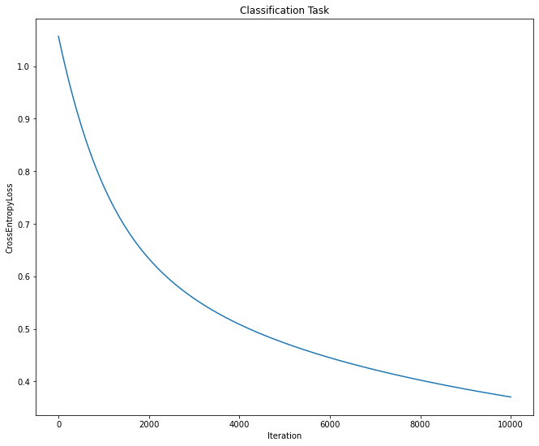

# Smaller MicroGrad
Tried to do autograd engine based on Karpathy's micrograd repo (and on the basis of PyTorch)

## Examples

### Regression (it actually learns something!)
```python
from autograd.tensor import Tensor
from autograd import nn
from autograd.optim import SGD
from sklearn.datasets import load_boston


class Regressor(nn.Module):
    def __init__(self,
                 in_features: int) -> None:
        super().__init__()

        self.l1 = nn.Linear(in_features, 32)
        self.l2 = nn.Linear(32, 1)
    
    def forward(self, x):
        return self.l2(self.l1(x).relu())


x, y = load_boston(return_X_y=True)
x, y = Tensor(x), Tensor(y).reshape(-1, 1)


net = Regressor(x.shape[1])
optimizer = SGD(net.parameters(), lr=1e-6)

errors = []
iters = 1000

for i in range(iters):
    net.zero_grad()

    loss = nn.MSELoss(net(x), y)
    errors.append(loss.data.flatten())

    loss.backward()
    optimizer.step()

print(np.sqrt(loss.data[0]))
```


### Classification (it also learns something!)
```python
from autograd.tensor import Tensor
from autograd import nn
from autograd.optim import SGD
from sklearn.datasets import load_iris


class Classifier(nn.Module):
    def __init__(self,
                 in_features: int,
                 out_features: int) -> None:
        super().__init__()

        self.l1 = nn.Linear(in_features, 32)
        self.l2 = nn.Linear(32, out_features)
    
    def forward(self, x):
        out = self.l1(x).relu()
        return self.l2(out).softmax(axis=1)


x, y = load_iris(return_X_y=True)
x = (x - x.mean(axis=0)) / x.std(axis=0)
x, y = Tensor(x), nn.one_hot(y)


net = Classifier(in_features=x.shape[1], out_features=3)
optimizer = SGD(net.parameters(), lr=3e-4)

errors = []
iters = 10000

for i in range(iters):
    net.zero_grad()

    loss = nn.CrossEntropyLoss(net(x), y)
    errors.append(loss.data.flatten())

    loss.backward()
    optimizer.step()

print(loss)
```



## References
* [Karpathy's micrograd](https://github.com/karpathy/micrograd)
* [A survey on automatic differentiation](https://arxiv.org/abs/1502.05767)
* [Backprop for a Linear Layer](https://web.eecs.umich.edu/~justincj/teaching/eecs442/notes/linear-backprop.html)
